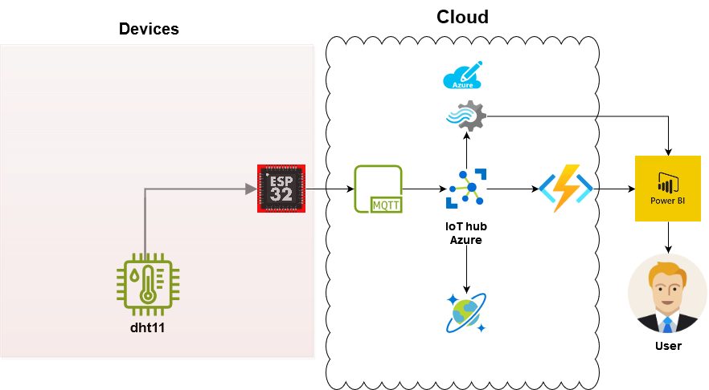
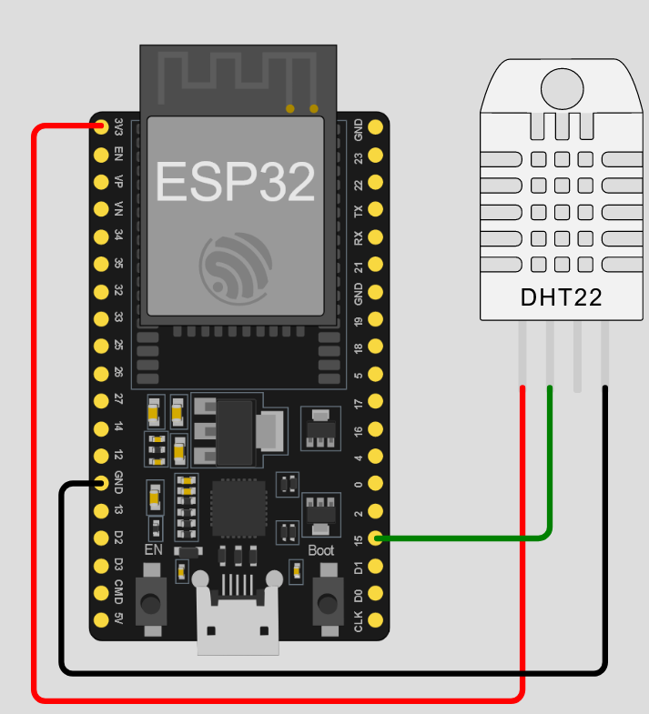
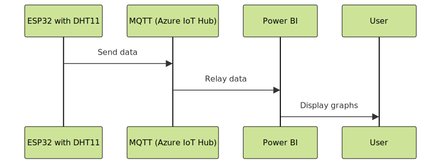
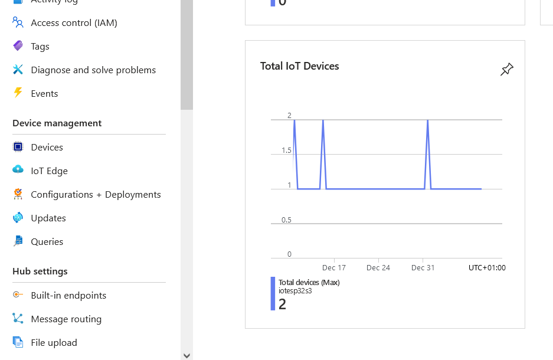

# Konfigurera Azure IoT Hub för ESP32-S och DHT11

## Innehållsförteckning
- [Översikt](#översikt)
- [Introduktion](#introduktion)
  - [Komponenter](#komponenter)
- [Instruktioner](#instruktioner)
  - [Steg 1: Skicka Data från ESP32 till Azure IoT Hub](#steg-1-skicka-data-från-esp32-till-azure-iot-hub)
  - [Steg 2: Uppkoppling](#steg-2-uppkoppling)
  - [Steg 3: Statistik](#steg-3-statistik)
- [Säkerhet/Skalbarhet](#säkerhetskalbarhet)
- [Slutsats](#slutsats)
- [Azure Funktioner och Databas Kod](#azure-funktioner-och-databas-kod)

## Översikt

*Översikt på diagramet för IoT-flödet setup.*

## Introduktion
Detta projekt är en omfattande guide för att konfigurera och använda Azure IoT Hub för att samla in och analysera data från en ESP32-S enhet kopplad till en DHT11-sensor. Genom att följa denna guide kommer du att kunna skapa en IoT-lösning som kan samla in, bearbeta och visualisera data i realtid. Detta kan vara särskilt användbart för olika IoT-applikationer, som att övervaka miljöförhållanden, skapa smarta hemlösningar eller för att förbättra affärsprocesser genom att använda datainsikter. Slutresultatet kommer att vara en fullt fungerande IoT-lösning som kan skala upp för att hantera stora mängder data och ge värdefulla insikter genom visualisering i PowerBI.

## Komponenter
- Ett aktivt Azure-konto.
- En IoT-hub på ditt Azure-konto.
- En ESP32-S och DHT11 som är korrekt konfigurerad och ansluten.
- Arduino IDE för att programmera ESP32.
- Stream Analytics för att bearbeta och analysera data.
- PowerBI för att visualisera data.
- Cosmos DB för att lagra data.


*Esp32 och DHT11 Setup*


*Hur komponenterna ska integreras med molnet*

## Steg-för-steg Instruktioner

### Steg 1: Nedladdningar
1. **Installera den senaste versionen av Arduino IDE från Arduino:s officiella webbplats**: Besök [Arduino](https://www.arduino.cc/en/software) och följ instruktionerna.
2. **Installera ESP8266-paketet i Arduino IDE**: Lägg till (http://arduino.esp8266.com/stable/package_esp8266com_index.json) i din Arduino IDE.
3. **Installera Azure SDK C-biblioteket**:
   - [ArdiunoJson](https://github.com/bblanchon/ArduinoJson): Installera ArduinoJson.
   - [PubSubClient](https://github.com/knolleary/pubsubclient): Installera PubSubClient.

### Steg 2: Uppkoppling
1. **Gå till din IoT Hub**: Navigera till din IoT Hub i Azure-portalen.
2. **Lägg till en enhet**:
   - Använd sensorn (temperatur- och fuktighetsmätare) för datainsamling.
   - Kolla in datainsamlingen på din IoT-enhet.
   
   - Bekräfta att enheten, t.ex. "ESP32-DHT11-Device", är insamlad och tar emot data.
   - Lämna "Authentication type" som "Symmetric Key".

```csharp
// Wifi
#define IOT_CONFIG_WIFI_SSID "SSID"
#define IOT_CONFIG_WIFI_PASSWORD "PWD"
// Azure IoT Config
#define IOT_CONFIG_IOTHUB_FQDN "[your Azure IoT host name].azure-devices.net"
#define IOT_CONFIG
```

### Steg 3: Statistik
- **Datainsamling via Cosmos DB**: Implementera Cosmos DB för att effektivt lagra och hantera data som samlas in från DHT11-sensorerna. Detta steg innebär att konfigurera databasen för att ta emot data från Azure IoT Hub och säkerställa att datan struktureras på ett sätt som underlättar analys och uppföljning.
- **Azure Functions**: Koppla Azure Functions till din IoT Hub. Detta steg fokuserar på att skapa serverlösa funktioner som automatiskt triggas av händelser från IoT Hub, vilket möjliggör realtidsbearbetning och respons på insamlade data.

### Steg 4: Testning och Validering
- **Verifiera anslutningen**: Gå igenom processen för att säkerställa att din ESP32-enhet konsekvent och korrekt överför data till Azure IoT Hub. Detta innebär att testa anslutningen under olika förhållanden och tider för att verifiera dess pålitlighet och stabilitet.
- **Felsökning**: Lär dig att använda verktyg och metoder för att identifiera och åtgärda problem som kan uppstå under drift. Detta inkluderar användning av Azure IoT Hub's inbyggda övervakning och loggfunktioner för att spåra och lösa problem.

### Steg 5: Säkerhet/Skalbarhet
- **Integrera Azure Device Provisioning Service (DPS)**: Detta avsnitt förklarar hur du kan använda Azure DPS för att automatisera processen för registrering och hantering av dina IoT-enheter, vilket säkerställer en smidig och säker uppskalning.
- **Använda Azure Key Vault och certifikat**: Här beskrivs hur du kan använda Azure Key Vault för att hantera och skydda känslig information som nycklar och lösenord, vilket är avgörande för att säkerställa integriteten och säkerheten i din IoT-lösning.
- **Uttnyttja Azures flexibla betalningsplaner**: Få information om hur du kan använda Azures betalningsplaner för att skalera din lösning kostnadseffektivt, baserat på ditt faktiska användningsmönster och behov.
- **Implementera MQTTS-protokollet**: Lär dig hur du kan implementera och använda MQTTS (MQTT över SSL/TLS) för säker dataöverföring mellan dina IoT-enheter och Azure IoT Hub, vilket är avgörande för att skydda data under överföring.

## Slutsats
I denna omfattande guide har vi gått igenom processen att sätta upp en robust och skalbar IoT-lösning med ESP32 och Azure IoT Hub. Vi har täckt allt från initial konfiguration och anslutning av enheter till att säkerställa säker dataöverföring och hantering. Med hjälp av Azure IoT Hub, Cosmos DB och Power BI har vi skapat en lösning som inte bara samlar in data från miljösensorer utan också analyserar och visualiserar denna data i realtid. Detta öppnar upp möjligheter för en mängd tillämpningar inom IoT, från smarta hemlösningar till avancerad miljöövervakning och affärsprocessoptimering. Framtiden för IoT är ljus, och med de rätta verktygen och teknikerna kan vi utnyttja dess fulla potential.
