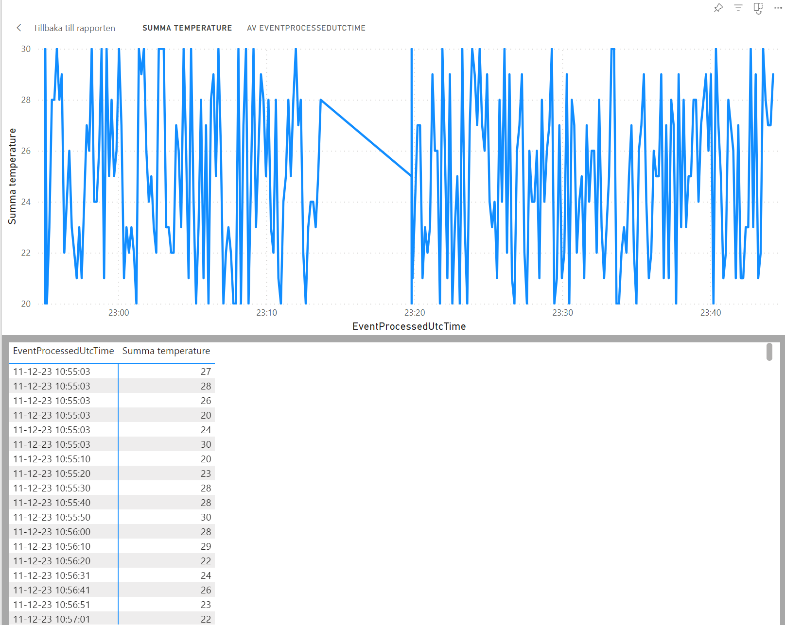

# Konfigurera Azure IoT Hub för ESP32-S och DHT11

## innehållsförteckning
- [Översikt](#översikt)
- [Introduktion](#Introduktion)
-   [Komponenter](#Komponenter) 
- [Instruktioner](#steg-1-skicka-data-från-esp32-till-azure-iot-hub) 
- [uppkoppling](#uppkoppling) 
-[statistik](#statistik)
- [säkerhet/skalbarhet](#testning-och-validering) 
- [Slutsats](#slutsats)
  
## översikt


*översikt på Diagramet för IoT flödet setup.*
--- 

## Introduktion
Detta projekt är en omfattande guide för att konfigurera och använda Azure IoT Hub för att samla in och analysera data från en ESP32-S enhet kopplad till en DHT11-sensor. Genom att följa denna guide kommer du att kunna skapa en IoT-lösning som kan samla in, bearbeta och visualisera data i realtid. Detta kan vara särskilt användbart för olika IoT-applikationer, som att övervaka miljöförhållanden, skapa smarta hemlösningar eller för att förbättra affärsprocesser genom att använda datainsikter. Slutresultatet kommer att vara en fullt fungerande IoT-lösning som kan skala upp för att hantera stora mängder data och ge värdefulla insikter genom visualisering i PowerBI.

## Komponenter
- Ett aktivt Azure-konto.
- En IoT-hub på ditt Azure-konto.
- En ESP32-S och DHT11 som är korrekt konfigurerad och ansluten.
- Arduino IDE för att programmera ESP32.
- Stream Analytics för att bearbeta och analysera data.
- PowerBI för att visualisera data.
- Cosmos DB för att lagra data.
  
---
   *Esp32 och DHT11 Setap* 


---
 
## Steg-för-steg
steg för steg över hur man ska installera och använda biblioteken i Arduino IDE för projektet.

### Steg 1 Nedladdningar: 
1. **Installera den senaste versionen av Arduino IDE från Arduino:s officiella webbplats**: Besök [Arduino](https://www.arduino.cc/en/software) och logga in med ditt konto.
2. **Installera ESP8266-paketet i Arduino IDE genom att följa instruktionerna.**:  (http://arduino.esp8266.com/stable/package_esp8266com_index.json). 
3. **installera [Azure SDK] C-biblotektet(https://github.com/Azure/azure-sdk-for-c-arduino) **:
   - **ArdiunoJson**: (https://github.com/bblanchon/ArduinoJson) installera [ArduinoJson].
   - **PubSubClient**(https://github.com/knolleary/pubsubclient)Installera [PubSubClient]. 

### Steg 2: Uppkoppling
1. **Gå till din IoT Hub**: Navigera till din nyligen skapade IoT Hub i Azure-portalen.
2. **Lägg till en enhet**:
   -användaren använder sensorn( temperatur-fuktighetsmätare)för data.
   -  kolla in på insamlingen på data hos IoT-enhen.
     
   -  IoThubenhet ska bekräfta att t.ex. "ESP32-DHT11-Device" är insamlad och tar emot data.
   - Lämna "Authentication type" som "Symmetric Key"  för wifi-anslutning och uppdatera den i filen config.


```
// Wifi
#define IOT_CONFIG_WIFI_SSID "SSID"
#define IOT_CONFIG_WIFI_PASSWORD "PWD"
```
sen config
```
// Azure IoT Config
#define IOT_CONFIG_IOTHUB_FQDN "[your Azure IoT host name].azure-devices.net"
#define IOT_CONFIG_DEVICE_ID "Device ID"
#define IOT_CONFIG_DEVICE_KEY "Device Key"
```
2.5 **Cosmo Db**:
   - Datainsamling sker via Cosmos DB-databas nosql för lagra data för sensorerna.
   
 **Azure Functions 
### Steg 3: Skicka Data från ESP32 till Azure IoT Hub
1. **Datacheck**:
   - Använd ett lämpligt utvecklingsverktyg för att Se på hur man kan se data. Inkludera tid ,datum och realtid för att läsa data från DHT11-sensorn. Bästa fall powerbl
     ** [basen] (https://github.com/Seta2022/azure/blob/main/azurefunktion/databas.C%23)till sql **:
   - **ArdiunoJson**: (https://github.com/bblanchon/ArduinoJson) installera [ArduinoJson]. 
   
-Gör en stream Analytics i Azure som hör av sig dataströmmen från IoT-huben. Optimera filtret 
så att du kan få den information du vill ha.
  
2. **Azure Function**: Anslut själva azure functionen till huben för att få in data.
3. Checka själva inkommande data genom olika slags metoder eller med hjälp av andra tillgängliga tekniker, för att ta emot och övervaka inkommande data.
4. Ställ in Azure-funktionen så att den behandlar och analyserar data från sensorer som tas emot.
```
//import azure.functions as func
//from azure.cosmos import CosmosClient
```

## Testning och validering
- **Verifiera anslutningen**: Kontrollera i Azure IoT Hub under "IoT devices" att data mottas från din ESP32-enhet.
- **Felsökning**: Använd verktyg som Azure IoT Hub's inbyggda monitor för att felsöka eventuella problem med dataöverföringen.

## Säkerhet/Skalbarhet
Vissa åtgärder som kan införas för att höja säkerhetsnivån och skalbarhet.

Integrera Azure Device Provisioning Service: Denna tjänst förenklar införandet av nya IoT-enheter genom att automatisera registreringsprocessen och centralisera hanteringen av nycklar och certifikat. Detta förbättrar säkerheten och effektiviserar implementeringen av nya enheter, vilket bidrar till ökad skalbarhet i projektet.

Användning av Azure Key Vault, certifikat och HSM: Dessa verktyg är avgörande för att skydda känsliga data som nycklar och lösenord. Med Azure Key Vault, certifikat och Hardware Security Modules (HSM) kan vi garantera att känslig information skyddas och inte riskerar att läcka ut via firmware eller bli oavsiktligt uppladdad till arkiv.

Uttnyttja Azures flexibla betalningsplaner: Azures skalbara och anpassningsbara betalningsplaner möjliggör effektiv skalning baserat på användningsmönster. Detta hjälper till att bibehålla projektets skalbarhet samtidigt som det kontrollerar kostnaderna.

Implementera MQTTS-protokollet: Genom att använda MQTTS (MQTT Secure), kan vi höja säkerhetsnivån vid dataöverföring. Genom krypterad kommunikation mellan IoT-noder, såsom Node-MCU ESP8266, och Azure IoT Hub via MQTT-protokollet, säkerställer vi en skyddad informationsöverföring och minskar risken för avlyssning och obehörig åtkomst.


## Slutsats
Genom att implementera dessa steg kan du effektivt sätta upp Azure IoT Hub för att samla in information från en ESP32-S ansluten till en DHT11-sensor. Insamlad data kan därefter användas för analys och visualisering. I detta projekt kombineras ESP32 med Azure IoT Hub för att mäta temperatur och luftfuktighet. Informationen lagras i Cosmos DB och presenteras för användaren genom realtidsvisualisering med Power BI. Projektet erbjuder en komplett lösning för att övervaka och analysera miljöförhållanden.


